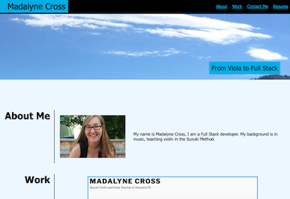

# Madalyne's Portfolio Project

## Description
Develop a portfolio to display current projects.

On the project learning: 
* HTML and CSS from scratch
* Website development steps

Challenges:
* Matching CSS to look like mockup
* HTML syntax for flexbox
* Images as links, where to wrap anchor tags

## Built With
* HTML
* CSS
  

## Website
Visit the [project](https://violanerd.github.io/Madalyne-Portfolio/)

## Contribution

Coded by Madalyne Cross